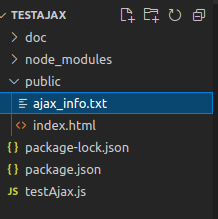
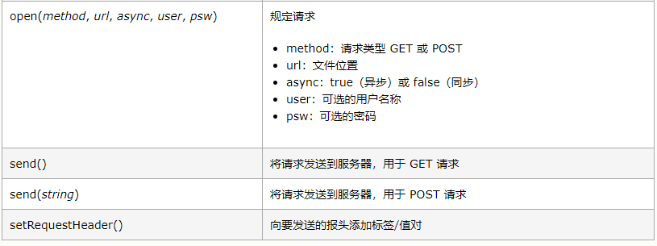

# Ajax 使用

## 一、第一个程序运行要求

```html
<!DOCTYPE html>
<html>
<body>

<div id="demo">
<h1>XMLHttpRequest 对象</h1>
<h2>微信转账三百块，帮我回想港</h2>
<button type="button" onclick="loadDoc()">修改内容</button>
</div>

<script>
function loadDoc() {
  var xhttp = new XMLHttpRequest();
  xhttp.onreadystatechange = function() {
    if (this.readyState == 4 && this.status == 200) {
      document.getElementById("demo").innerHTML =
      this.responseText;
    }
  };
  xhttp.open("GET", "/ajax_info.txt", true);
  xhttp.send();
}
</script>

</body>
</html>

```

​		程序中有个按钮：

```html
<button type="button" onclick="loadDoc()">修改内容</button>
```

​		按钮中有onclick事件，调用了loadDoc（）方法，其中有语句：

```javascript
xhttp.open("GET", "/ajax_info.txt", true);
```

说明要使用get方法访问服务器/ajax_info.txt文件内容，所以建立服务器，为了不跨域，将文件以静态文件映射到根目录下，从服务器发送

​		程序：

```js
const express = require("express");
const app = express();
app.use('/',express.static('public'));      //将public文件夹映射到根目录下
app.listen(10317);
```


​		服务器文件结构：



服务器与index.html页面中的ajax访问路径有对应内容


## 二、ajax程序分析

### 1.生成请求实例

​		var xhttp = new XMLHttpRequest();

​		程序生成了一个xhttp的请求实例

​	**Ajax 的核心是 XMLHttpRequest 对象。**

​		XMLHttpRequest 对象
​		所有现代浏览器都支持 XMLHttpRequest 对象。

​		XMLHttpRequest 对象用于同幕后服务器交换数据。这意味着可以更新网页的部分，而不需要重新加载整个页面。

​		XMLHttpRequest对象方法

### 2.readyState


​		保存了 XMLHttpRequest 的状态。

0: 请求未初始化
1: 服务器连接已建立
2: 请求已接收
3: 正在处理请求
4: 请求已完成且响应已就绪